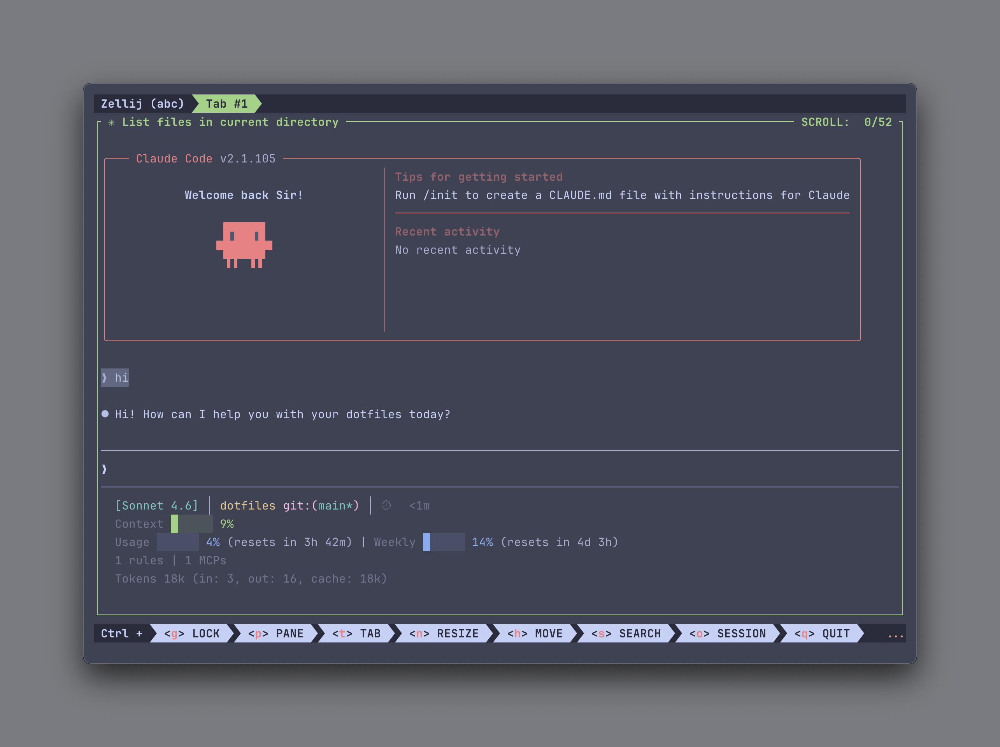

# 🍄 My Dotfiles

> 一份让终端变好看、好用的配置文件集合。支持一键安装，换新电脑也不怕。



---

## ⚠️ 使用前必读

**这是一份个人 dotfiles，在运行安装脚本前，请先确认以下事项：**

### 脚本会做哪些「破坏性操作」

| 操作 | 说明 | 影响 |
|------|------|------|
| **卸载 Oh My Zsh** | 如果检测到 `~/.oh-my-zsh` 目录，会直接删除 | 你在 Oh My Zsh 里的主题、插件配置会丢失 |
| **覆盖 `~/.zshrc`** | 用 stow 将本仓库的 `.zshrc` 链接到 `~`，原文件会备份到 `~/.dotfiles_backup_*` | 你原来的 zshrc 配置会被替换 |
| **覆盖其他配置文件** | `~/.config/nvim`、`~/.config/tmux` 等如有冲突，原文件同样会备份 | 原有编辑器、终端配置会被替换 |
| **替换 nvm 为 fnm** | 不会删除 `~/.nvm` 目录，但 zshrc 不再加载 nvm | 原来通过 nvm 安装的 Node 版本需重新用 fnm 安装 |

> 💡 所有被替换的文件都会备份到 `~/.dotfiles_backup_时间戳/`，不会永久丢失，但需要手动恢复。

### 适合使用这份配置的情况

- ✅ 全新 Mac，还没有任何终端配置
- ✅ 愿意完全采用这套工具链（Zsh + Ghostty + Zellij/tmux + Neovim）
- ✅ 用作参考，挑选部分配置手动整合到自己的 dotfiles

### 不适合直接使用的情况

- ❌ 已有精心调校的 Oh My Zsh 配置且不想丢失
- ❌ 使用的是其他终端或 Shell 环境

---

## ✨ 包含什么

| 工具 | 说明 |
|------|------|
| 🖥️ **Ghostty** | 终端模拟器配置，背景透明 + 高斯模糊，Catppuccin Frappé 主题 |
| 🌟 **Starship** | 命令行提示符，显示 git 状态、语言版本、命令耗时等 |
| 🪟 **tmux** | 终端分屏工具，Catppuccin Frappé 主题 |
| 🪟 **Zellij** | 另一款终端分屏工具，Catppuccin Frappé 主题 |
| 📝 **Neovim** | 代码编辑器，LazyVim 框架，Catppuccin Frappé 主题 |
| 🐚 **Zsh** | Shell 配置，包含常用别名、工具初始化和启动速度优化 |

所有主题统一使用 [Catppuccin Frappé](https://github.com/catppuccin/catppuccin) 🎨

---

## 🚀 在新电脑上快速安装

> 💡 以下步骤需要在终端中操作。Mac 自带的终端叫 **Terminal**，在「应用程序 → 实用工具」里可以找到。

### 第一步：安装 Ghostty 终端

推荐先安装 [Ghostty](https://ghostty.org)，这份 dotfiles 的终端配置基于它。

下载安装后打开 Ghostty，后续所有操作在 Ghostty 里进行。

### 第二步：克隆配置到本地

```bash
git clone --recurse-submodules https://github.com/xbo89/my-dotfiles.git ~/dotfiles
```

> 💡 `--recurse-submodules` 会同时拉取 tmux 主题等依赖。如果忘记加这个参数也没关系，下一步的安装脚本会自动补上。

### 第三步：运行一键安装脚本

```bash
cd ~/dotfiles && chmod +x bootstrap.sh && ./bootstrap.sh
```

脚本会自动完成以下所有事情：

| 步骤 | 内容 |
|------|------|
| 1 | 安装 Xcode Command Line Tools |
| 2 | 安装 Homebrew |
| 3 | 安装所有命令行工具（via Brewfile） |
| 4 | 卸载 Oh My Zsh（如果有） |
| 5 | 通过 fnm 安装 Node.js LTS，并设为默认版本 |
| 6 | 安装 Claude Code CLI（最新版） |
| 7 | 安装 bat 的 Catppuccin Frappé 主题 |
| 8 | 初始化 git submodules（tmux 插件等） |
| 9 | 用 stow 关联所有配置文件 |
| 10 | 检测 Ghostty 配置冲突并提示 |

> ⏱️ 第一次安装约需 5–10 分钟，取决于网速。

### 第四步：重载配置

```bash
source ~/.zshrc
```

### 第五步：安装 Neovim 插件

```bash
nvim
```

第一次打开会自动下载安装所有插件，等待完成即可（约 1–2 分钟）。

---

## 🔧 Ghostty 配置说明

安装完成后，如果 Ghostty 主题没有生效，可能是 Ghostty 自己的配置文件覆盖了 dotfiles 的配置。

打开以下路径的文件：

```
~/Library/Application Support/com.mitchellh.ghostty/config
```

> 💡 在 Finder 里按 `Cmd + Shift + G`，粘贴上面的路径即可打开。

将文件里所有内容注释掉（每行开头加 `#`），保存后重启 Ghostty 即可。

---

## 🔄 日常更新

```bash
# 拉取最新配置
cd ~/dotfiles && git pull && git submodule update --remote

# 安装新增的工具（只补缺，不动已有的）
brew bundle

# 更新所有已安装的工具
brew update && brew upgrade
```

> 💡 以后在 dotfiles 里新增工具只需往 `Brewfile` 加一行，另一台电脑 `brew bundle` 就会自动补装，不需要记住改了什么。

---

## 🛠️ 手动关联某个配置

如果某个工具的配置没有生效，可以手动重新关联：

```bash
cd ~/dotfiles
stow -d ~/dotfiles -t ~ ghostty   # Ghostty
stow -d ~/dotfiles -t ~ starship  # Starship
stow -d ~/dotfiles -t ~ tmux      # tmux
stow -d ~/dotfiles -t ~ zellij    # Zellij
stow -d ~/dotfiles -t ~ nvim      # Neovim
stow -d ~/dotfiles -t ~ zshrc     # Zsh
```

---

## 📦 包含的命令行工具

| 工具 | 用途 |
|------|------|
| `fnm` | Node.js 版本管理（快速，兼容 `.nvmrc`） |
| `exa` | 更好看的 `ls`（带图标、颜色） |
| `bat` | 更好看的 `cat`（带语法高亮，Catppuccin Frappé 主题） |
| `fzf` | 模糊搜索 |
| `zoxide` | 智能 `cd`，自动记忆常用目录 |
| `atuin` | 更强大的命令历史搜索 |
| `yazi` | 终端文件管理器 |
| `lazygit` | 终端里的 Git 图形界面 |
| `lazydocker` | 终端里的 Docker 图形界面 |
| `ripgrep` | 超快的文件内容搜索 |
| `starship` | 漂亮的命令行提示符 |

---

## ❓ 常见问题

**Q: 命令找不到（command not found）**

重新加载配置：
```bash
source ~/.zshrc
```

**Q: starship / zoxide / atuin 没生效**

删除缓存，让它重新生成：
```bash
rm ~/.zsh_cache/*.zsh && source ~/.zshrc
```

**Q: tmux 主题没有生效**

在 tmux 里按 `Ctrl+b`，然后输入 `:source ~/.config/tmux/tmux.conf`

**Q: node -v 显示的版本和 fnm 不一致**

删除 fnm 的空缓存，重新加载：
```bash
rm ~/.zsh_cache/fnm.zsh && source ~/.zshrc
```

**Q: 安装脚本报错了**

把报错信息复制下来，查看是哪一步出了问题。通常重新运行一次即可解决：
```bash
./bootstrap.sh
```

---

## 🎨 主题

所有工具统一使用 [Catppuccin Frappé](https://github.com/catppuccin/catppuccin)——一个深色护眼、颜值在线的主题。

---

<p align="center">Made with ☕ and 🎨</p>
